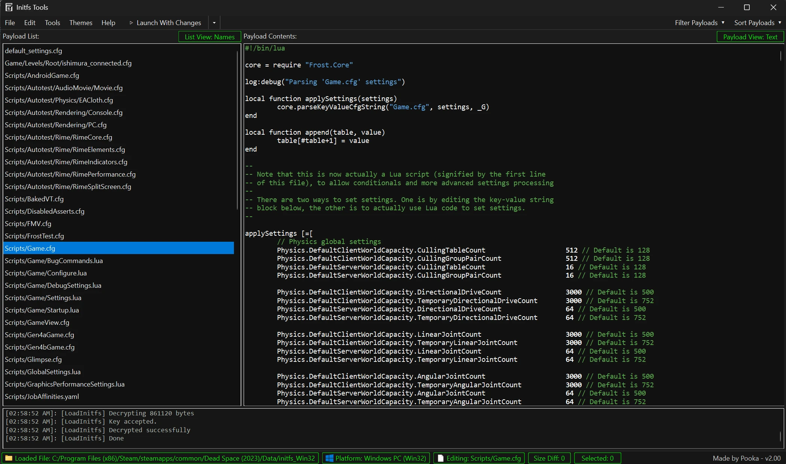

# Frostbite InitFS Tools
The ultimate toolsuite for all things InitFS related, 
featuring multi-format decryption support, a command dictionary, type extractor, diff checker, and more.

Note: If an InitFS file asks you for an AES key, I will not provide it. A quick google search may help.

Massive thank you to the original FrostyToolsuite team, you can check them here: https://github.com/CadeEvs/FrostyToolsuite

ISSUE: Some games may not load with a custom initfs file on Windows 10. This will be fixed in version 2.10 coming soon!

ISSUE 2: The program will not run when the language is set to anything other than English. Use the beta builds for now, will be fixed soon.

## Features
- **InitFS Modding** — Load, modify, and save InitFS files across all Frostbite Engine games
- **Diff Check** — Compare differences between two InitFS files, with export support
- **Type Extractor** — Extract all types and commands from a game executable or FrostyEditor SDK DLL
- **Command Dictionary** — Generate and browse a full list of console commands extracted from raw InitFS files
- **Reference Library** — Browse and view base and custom payloads from various Frostbite titles
- **Preset Manager** — Browse and insert user-saved presets containing sets of useful commands

## TODO (the crossed-out issues are fixed in 2.10, releasing soon):
- Fix Dingo mode logic as it's incorrect and needs proper polishing (Type Extractor)
- ~~Fix Squadrons using the wrong mode - should use Walrus (Type Extractor)~~
- ~~Fix NFS Payback using the wrong mode - should use Walrus (Type Extractor)~~
- ~~Fix Mirror's Edge using the wrong mode - should use Havana (Type Extractor)~~
- ~~Fix FIFA 17 using the wrong mode - should use Contact (Type Extractor)~~
- ~~Fix Dragon Age Inquisition support - only works in 2.0.0-beta2 (Type Extractor)~~
- ~~Implement Mass Effect Andromeda support (Type Extractor)~~
- Implement PGA Tour support (Type Extractor)
- Implement Battlefield Hardline support (Type Extractor)
- Fully implement Dead Space and Need For Speed Heat support for live value reading
- ~~Fix a bug where the bcrypt.dll gets copied after the user hits ok, should be before~~
- ~~Fix an issue where the green highlight may disappear when deleting spaces~~
- ~~Fix an issue where highlights are invisible (Diff Check)~~
- Fix an issue where the dictionary filters stop working (Dictionary)
- Finish DictionaryWindow logic to support more dev commands (Dictionary)
- ~~Fix the program not fully closing when tool windows are active~~
- ~~Fix an issue where the program crashes if you attempt to load a deleted InitFS file~~
- Fix an issue where the Recent InitFS file text uses the wrong styling
- Finish InitfsTools Wiki (help wanted!)
- Implement localization support for the UI
- Implement "GoTo" default commands
- Implement CLI support (requested by JIREX)

## COMING SOON:
- Console Injector — Hooks into a game's console, unlocks all commands, and executes them remotely (confirmed working in: DelMar, MEA, BFH, BF4, SWBF2, SWBF2015, BFN, GW2, GW1, NFS Unbound, NFS Heat, NFS Payback, Need For Speed, NFS Rivals, Mirror's Edge, PGA Tour, DAV, DAI)

## License
The Content, Name, Code, and all assets are licensed under a Creative Commons Attribution-NonCommercial-NoDerivatives 4.0 International License.

## Disclaimer
InitfsTools is an independent, community-developed project with no affiliation, endorsement, or sponsorship from Electronic Arts Inc. or any other rights holder.
This software exists solely for educational, research, and preservation purposes. It is neither official software nor a product of EA or any publisher. The maintainers assert no ownership over any publisher code/assets - only what is minimally necessary to achieve basic functionality for the purposes described above.
By using InitfsTools, you accept full responsibility for ensuring your use complies with all applicable laws and with any terms of service or end-user license agreements governing the software you use it with.

See [docs](./docs) for build instructions.
