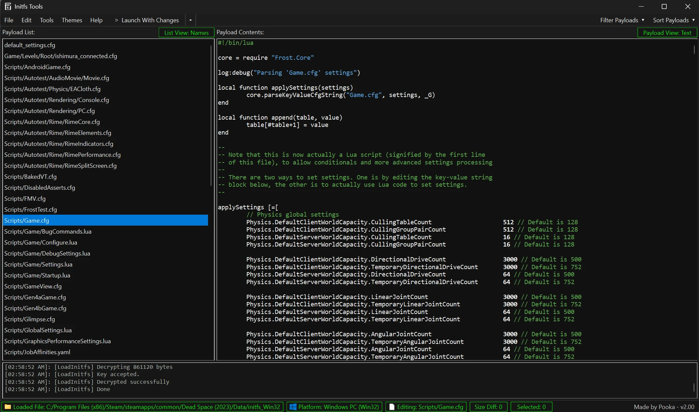

# Frostbite InitFs Tools
The ultimate tool suite for all things InitFs related, 
featuring multi-format decryption support, a command dictionary, type extractor, diff checker, console injector, CLI support, and more...

**Download Now: >> https://github.com/pookatv/InitfsTools/releases/tag/v2.15 <<**

Note: If an InitFs file asks you for an AES key, I will not provide it. A quick google search may help.

## Features
- **InitFs Modding** - Load, modify, and save InitFs files across all Frostbite Engine games
- **Diff Check** - Compare differences between two InitFs files, with export support
- **Type Extractor** - Extract all types and commands from a game executable or FrostyEditor SDK DLL
- **Command Dictionary** - Generate and browse a full list of console commands extracted from raw InitFs files
- **Reference Library** - Browse and view base and custom payloads from various Frostbite titles
- **Preset Manager** - Browse and insert user-saved presets containing sets of useful commands
- **Console Injector** - Hooks into a game's console, unlocks all commands, and executes them remotely/in-game

## TODO (strikethrough lines have been fixed and included in the next update):
- Revert the InitFs file automatically after reverting the AC patcher
- ~~Fix console overlay not properly appearing in newer 2022+ games (Console Injector)~~
- Fix unlock all commands logic for newer 2022+ games such as NFS Unbound and DAV (Console Injector)
- ~~Fix command output handling for some games (Console Injector)~~
- Fix compatibility with ReShade when using proxy mode (Console Injector)
- Fix an issue where the same commands may appear twice on the console overlay (Console Injector)
- Add eventual support for Emulators/Consoles? (Console Injector)
- Fix Dingo mode logic as it's incorrect and needs proper polishing (Type Extractor)
- Implement PGA Tour support (Type Extractor)
- Implement Battlefield Hardline support (Type Extractor)
- Fully implement Dead Space and Need For Speed Heat support for live value reading
- Finish DictionaryWindow logic to support more dev commands (Dictionary)
- Fix an issue where the Recent InitFs file text uses the wrong styling
- Fix an issue where message boxes are using the wrong theme on Windows 10
- Finish InitfsTools Wiki (help wanted!)
- Implement localization support for the UI
- Implement "GoTo" default commands
- Implement tab system
- Implement back/forward arrow system
- Implement "Add ApplySettings Block" option

# Note: I will spend month time on vacation without working on this - feel free to contribute your own changes

## Credits
- Pookatv - Project lead
- Twig6943 - Linux support and build improvements
- Andersson799 - DLL functions
- Nuuby - Console functions

Massive thank you to the original FrostyToolsuite team; you can check them here: https://github.com/CadeEvs/FrostyToolsuite

## License
The Content, Name, Code, and all assets are licensed under a Creative Commons Attribution-NonCommercial-NoDerivatives 4.0 International License.

## Disclaimer
InitfsTools is an independent, community-developed project with no affiliation, endorsement, or sponsorship from Electronic Arts Inc. or any other rights holder.
This software exists solely for educational, research, and preservation purposes. It is neither official software nor a product of EA or any publisher. The maintainers assert no ownership over any publisher code/assets - only what is minimally necessary to achieve basic functionality for the purposes described above.
By using InitfsTools, you accept full responsibility for ensuring your use complies with all applicable laws and with any terms of service or end-user license agreements governing the software you use it with.
This tool is not responsible for any account suspensions when using this alongside the EAAC (if applicable).

See [docs](./docs) for build instructions.
